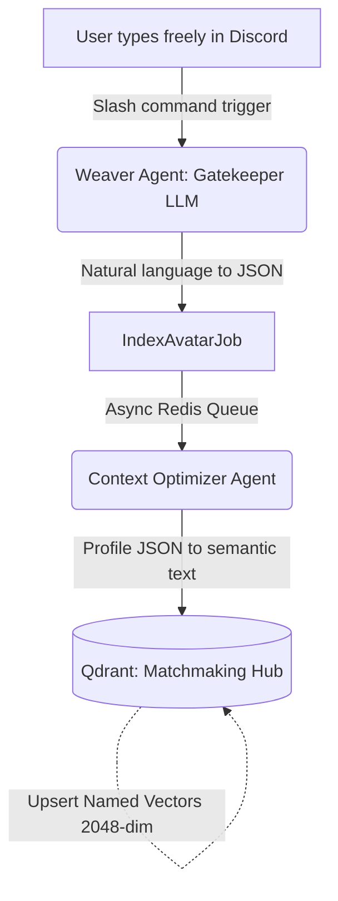
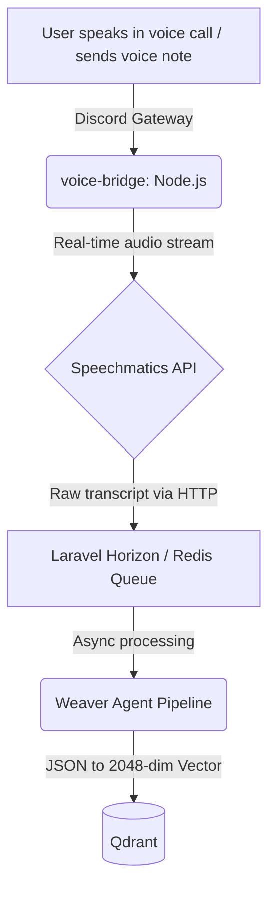

<div align="center">
  <h1>🌌 MUDRAIS</h1>
  <p><b>Multi-User Dynamic Roleplay AI System</b></p>
  
  [](#)
  [](#)
  [](#)
  [](#)
  [](#)
  [](#)
</div>

---

**Multi-User Dynamic Roleplay AI System** — a semantic matchmaking engine built on an asynchronous, model-agnostic enterprise architecture. The platform eliminates static onboarding forms through two multimodal abstraction layers: **MUDRAIS Weaver** and **MUDRAIS Voice**.

This project is the backend of Historia Pipeline, migrated to a **Domain-Driven Design (DDD)** architecture using Laravel, Filament for administration, and Alpine.js for interactivity.

## ✨ Core AI Layers

### 1. MUDRAIS Weaver (Conversational Onboarding)
Weaver is a conversational AI agent that replaces rigid modals and forms entirely. Instead of presenting a static questionnaire, the agent interacts with the user through natural chat — extracting metadata, evaluating context, and dynamically structuring a validated JSON schema in the background. A cold data-collection step becomes a warm, functional onboarding experience.

**How it works:**


### 2. MUDRAIS Voice (Multimodal Ingestion)
Voice is the multimodal layer. The user joins a call or sends a voice note and speaks freely about their profile, interests, archetype, and narrative preferences. No keyboard required.

The pipeline uses **Speechmatics** for ultra-high-fidelity real-time transcription. The raw transcript feeds the AI orchestrator, which reasons over the response, extracts psychological and narrative variables, and produces a fully structured profile vector.

**How it works:**

> **Note:** The `voice-bridge` service is a standalone Node.js container that connects to Discord's voice gateway, streams audio to Speechmatics, and forwards the transcript to Laravel for asynchronous processing.

---

## 🚀 Quick Start & Installation

The entire project is run using **Laravel Sail** to avoid compatibility issues and driver dependencies. It uses Docker containers, ensuring an identical environment across machines.

### Prerequisites
- [Docker Desktop](https://www.docker.com/products/docker-desktop/) or Docker Engine with Docker Compose.
- PHP and Composer *(only for the initial dependency installation, or use Sail's temporary container)*.
- Node.js and NPM *(optional — can also be run through Sail)*.

### 1. Configuration and Environment Variables
Clone the project and navigate to the application folder:
```bash
cd laravel_app
```

Create the configuration file by copying the example:
```bash
cp .env.example .env
```

Configure the **Qdrant** (vector database) environment variables in your `.env`. Recommended values for local development:
```env
QDRANT_HOST=localhost
QDRANT_PORT=6333
QDRANT_API_KEY=
QDRANT_COLLECTION_NAME=your_collection
```

### 2. Starting the Server (Main Environment)
Install PHP dependencies using Composer locally, or use a temporary container:
```bash
composer install
```

Start the Docker services (PostgreSQL, Qdrant, Redis, and Ngrok) in the background:
```bash
./vendor/bin/sail up -d
```

Generate the application key and run migrations/seeders:
```bash
./vendor/bin/sail artisan key:generate
./vendor/bin/sail artisan migrate --seed
```

Install Node.js dependencies:
```bash
./vendor/bin/sail npm install
```

---

## ⚙️ Required Workers

For the ecosystem and pipeline to function correctly in async mode, run the following processes in separate terminals. Always use Sail for these commands:

### 1. Queue Worker (Async Jobs)
Processes background tasks (LLM calls, text processing, etc.):
```bash
./vendor/bin/sail artisan queue:work
```
*(Use `queue:listen` in development to automatically pick up code changes without restarting).*

### 2. Frontend Server (Vite)
Compiles and serves assets in real time (TailwindCSS, Alpine.js, Filament scripts):
```bash
./vendor/bin/sail npm run dev
```

### 3. Scheduler (Optional)
If there are tasks that run every minute:
```bash
./vendor/bin/sail artisan schedule:work
```

---

## 🐳 Docker Services (compose.yaml)

Running `sail up -d` starts the following services:
- **laravel.test**: Main web server with PHP 8.x + Supervisor (Horizon + Discord gateways).
- **pgsql**: PostgreSQL relational database.
- **qdrant**: Vector database (dashboard at `http://localhost:6333/dashboard`).
- **redis**: Cache and queue backend (used by Horizon and voice-bridge).
- **voice-bridge**: Node.js service that connects to Discord's voice gateway and delegates to Speechmatics + Laravel.
- **ngrok**: Exposes your local project temporarily (development only).

---

## 📚 Documentation

Technical documentation lives in [`docs/functional/`](docs/functional/README.md).

| Document | Purpose |
|---|---|
| [architecture.md](docs/functional/architecture.md) | Stack, DDD, models, bounded contexts, glossary |
| [archetype-setup.md](docs/functional/archetype-setup.md) | Full guide for creating an archetype from scratch in Filament |
| [prompt-configuration.md](docs/functional/prompt-configuration.md) | How to configure, maintain, and debug AI prompts per archetype |
| [prompt-flow.md](docs/functional/prompt-flow.md) | AI pipelines: origins, placeholders, agents involved |
| [discord-commands.md](docs/functional/discord-commands.md) | Slash command reference: payloads, responses, jobs |
| [queue-workers.md](docs/functional/queue-workers.md) | Worker configuration: Docker, VPS + Supervisor, Shared Hosting + Cron |

**User guides**

| Document | Language |
|---|---|
| [user-guide-es.md](docs/user-guide-es.md) | Spanish |
| [user-guide-en.md](docs/user-guide-en.md) | English |

> Documents in `docs/obsolete/` and `docs/plans/` are historical reference and may not be up to date.

## License
Distributed under the [MIT License](LICENSE).

## Notes
- **Artisan commands:** Never run `php artisan ...` directly. Always use `./vendor/bin/sail artisan ...` to avoid database driver or missing PHP extension issues.
- **Project state:** All tasks and progress are tracked in `estado_proyecto.json` by the agents.
- **Access:** The application is available at `http://localhost` and the vector database dashboard at `http://localhost:6333/dashboard`.
